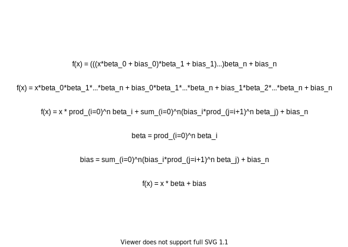
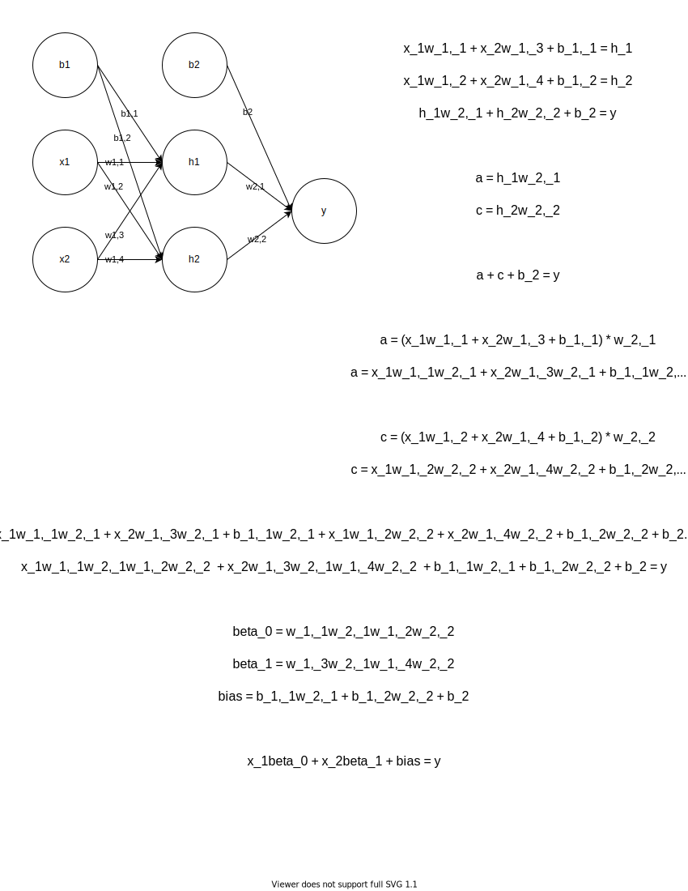

# Why Neural Networks Have Activation Functions
This repository contains the source code for my article *Why Neural Networks Have Activation Functions* on [Medium](medium.com).

The scripts from the article can be found at the source level of this directory, they're each parameterized at the global context, just under the import statements. The gifs from the article are found in the `gifs` directory and the proofs can be found in the `math` directory.

## Scripts
### `single_example.py`
This script creates 9 univariate linear models, and iteratively fits an OLS model to each. This script produces the `gifs/single_var.gif` file.

### `ff_example.py`
This script creates a random Multilayer Perceptron and fits an equivalent OLS model to its inputs and outputs. This script produces statistics on the OLS models `r2` and `MSE` when compared to the neural network outputs and it's own outputs.

### `cnn_example.py`
This script creates a random Convolutional Neural Network and fits an equivalent OLS model to its inputs and outputs. This script produces statistics on the OLS models `r2` and `MSE` when compared to the neural network outputs and it's own outputs.

### `rnn_example.py`
This script creates a random Recurrent Neural Network and fits an equivalent OLS model to its inputs and outputs. This script produces statistics on the OLS models `r2` and `MSE` when compared to the neural network outputs and it's own outputs.

### `xor_example.py`
This script takes a command line argument `-a` or `--activation`, this command line argument changes the activation function used by the hidden layer. Usage example:

```
python3 xor_example.py -a linear
```
or
```
python3 xor_example.py -a relu
```

The value of the argument passed must be one of kera's activation functions. This script products the `gifs/nn_xor_<activation>.gif` files, where `<activation>` corresponds to the command line argument `-a`, the default is `linear`.

## Math
Below are the proofs presented in the article.

